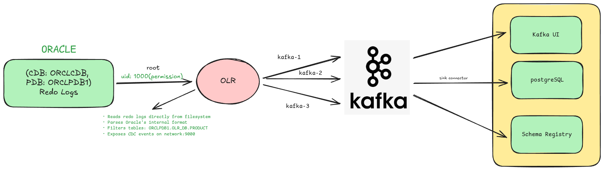

# Oracle CDC with OpenLogReplicator and Kafka

A production-ready Change Data Capture (CDC) pipeline that streams Oracle database changes to Apache Kafka using OpenLogReplicator.



## Table of Contents

- [Prerequisites](#prerequisites)
- [Architecture Overview](#architecture-overview)
- [Quick Start](#quick-start)
- [Configuration](#configuration)
  - [Directory Setup](#1-directory-setup)
  - [Oracle and OpenLogReplicator Setup](#2-oracle-and-openlogreplicator-setup)
  - [Kafka Ecosystem Setup](#3-kafka-ecosystem-setup)
- [Connector Configuration](#connector-configuration)
- [Verification](#verification)
- [Troubleshooting](#troubleshooting)

## Prerequisites

- Docker Engine 20.10+
- Docker Compose v2.0+
- Minimum 16GB RAM (8GB for Oracle, 4GB for Kafka)
- 20GB+ available disk space
- Access to Oracle Container Registry (for Oracle database image)

## Architecture Overview

| Component | Description |
|-----------|-------------|
| Oracle 19c | Source database with ARCHIVELOG enabled |
| OpenLogReplicator | High-performance Oracle redo log reader |
| Apache Kafka | Distributed event streaming platform (3-node cluster) |
| Kafka Connect | JDBC sink connector for PostgreSQL |
| Schema Registry | Avro schema management for Kafka |
| ksqlDB | Stream processing engine |
| Kafka UI | Web interface for monitoring |
| PostgreSQL | Sink database |

## Quick Start

```bash
# 1. Create Docker network
docker network create cdc-net

# 2. Create required directories for scripts
mkdir -p scripts-db scripts

# 3. Start Oracle and OpenLogReplicator
docker compose -f docker-compose-olr.yml up -d

# 4. Fix volume permissions for OpenLogReplicator (runs as uid 54321)
docker run --rm \
  -v orl-oraclenodbz_olr_checkpoint:/checkpoint \
  -v orl-oraclenodbz_olr_log:/log \
  alpine chown -R 54321:54321 /checkpoint /log

# 5. Restart OpenLogReplicator to apply permissions
docker restart openlogreplicator

# 6. Wait for Oracle to be healthy, then start Kafka ecosystem
docker compose -f docker-compose-main.yml up -d

# 7. Access Kafka UI
open http://localhost:8081
```

---

## Configuration

### 1. Directory Setup

Create the required directories for scripts:

```bash
# Create directories for scripts (mounted as bind mounts)
mkdir -p scripts-db scripts
```

> **Note:** OpenLogReplicator checkpoint and log directories use Docker named volumes (`olr_checkpoint`, `olr_log`). After first run, fix permissions with:
> ```bash
> docker run --rm \
>   -v orl-oraclenodbz_olr_checkpoint:/checkpoint \
>   -v orl-oraclenodbz_olr_log:/log \
>   alpine chown -R 54321:54321 /checkpoint /log
> ```

### 2. Oracle and OpenLogReplicator Setup

#### 2.1 Create Docker Network

```bash
docker network create cdc-net
```

#### 2.2 Oracle Setup SQL

Create `scripts-db/set-up-olr.sql`:

```sql
SET ECHO ON;
SET SERVEROUTPUT ON;
WHENEVER SQLERROR EXIT FAILURE;

-- 1. Enable ARCHIVELOG mode (skip when already enable from docker-compose)
DECLARE
    v_log_mode VARCHAR2(10);
BEGIN
    SELECT log_mode INTO v_log_mode FROM v$database;
    IF v_log_mode != 'ARCHIVELOG' THEN
        EXECUTE IMMEDIATE 'SHUTDOWN IMMEDIATE';
        EXECUTE IMMEDIATE 'STARTUP MOUNT';
        EXECUTE IMMEDIATE 'ALTER DATABASE ARCHIVELOG';
        EXECUTE IMMEDIATE 'ALTER DATABASE OPEN';
        DBMS_OUTPUT.PUT_LINE('ARCHIVELOG mode enabled.');
    ELSE
        DBMS_OUTPUT.PUT_LINE('ARCHIVELOG mode already enabled.');
    END IF;
END;
/

-- Set recovery area size
ALTER SYSTEM SET db_recovery_file_dest_size = 10G SCOPE=BOTH;

-- Enable minimal supplemental logging (required for both LogMiner and OLR)
ALTER DATABASE ADD SUPPLEMENTAL LOG DATA;

-- 2. Create LogMiner tablespace in CDB (idempotent)
BEGIN
    EXECUTE IMMEDIATE 'CREATE TABLESPACE LOGMINER_TBS DATAFILE ''/opt/oracle/oradata/ORCLCDB/logminer_tbs.dbf'' SIZE 100M REUSE AUTOEXTEND ON NEXT 100M MAXSIZE UNLIMITED';
    DBMS_OUTPUT.PUT_LINE('LOGMINER_TBS tablespace created in CDB.');
EXCEPTION
    WHEN OTHERS THEN
        IF SQLCODE = -1543 THEN
            DBMS_OUTPUT.PUT_LINE('LOGMINER_TBS tablespace already exists in CDB.');
        ELSE
            RAISE;
        END IF;
END;
/

-- Switch to PDB and create tablespace there
ALTER SESSION SET CONTAINER = ORCLPDB1;

BEGIN
    EXECUTE IMMEDIATE 'CREATE TABLESPACE LOGMINER_TBS DATAFILE ''/opt/oracle/oradata/ORCLCDB/ORCLPDB1/logminer_tbs.dbf'' SIZE 100M REUSE AUTOEXTEND ON NEXT 100M MAXSIZE UNLIMITED';
    DBMS_OUTPUT.PUT_LINE('LOGMINER_TBS tablespace created in PDB.');
EXCEPTION
    WHEN OTHERS THEN
        IF SQLCODE = -1543 THEN
            DBMS_OUTPUT.PUT_LINE('LOGMINER_TBS tablespace already exists in PDB.');
        ELSE
            RAISE;
        END IF;
END;
/

-- Back to CDB
ALTER SESSION SET CONTAINER = CDB$ROOT;

-- 3. Create common user c##dbzuser (idempotent)
DECLARE
    v_count NUMBER;
BEGIN
    SELECT COUNT(*) INTO v_count FROM dba_users WHERE username = 'C##DBZUSER';
    IF v_count = 0 THEN
        EXECUTE IMMEDIATE q'[
            CREATE USER c##dbzuser IDENTIFIED BY dbz
            DEFAULT TABLESPACE LOGMINER_TBS
            QUOTA UNLIMITED ON LOGMINER_TBS
            CONTAINER=ALL
        ]';
        DBMS_OUTPUT.PUT_LINE('User c##dbzuser created.');
    ELSE
        DBMS_OUTPUT.PUT_LINE('User c##dbzuser already exists.');
    END IF;
END;
/

-- 4. Grant permissions for c##dbzuser (CDB level)
GRANT CREATE SESSION TO c##dbzuser CONTAINER=ALL;
GRANT SET CONTAINER TO c##dbzuser CONTAINER=ALL;
GRANT CONNECT TO c##dbzuser;
GRANT RESOURCE TO c##dbzuser;

-- Database dictionary access
GRANT SELECT ON V_$DATABASE TO c##dbzuser CONTAINER=ALL;
GRANT SELECT ON V_$LOG TO c##dbzuser CONTAINER=ALL;
GRANT SELECT ON V_$LOGFILE TO c##dbzuser CONTAINER=ALL;
GRANT SELECT ON V_$ARCHIVED_LOG TO c##dbzuser CONTAINER=ALL;
GRANT SELECT ON V_$PARAMETER TO c##dbzuser CONTAINER=ALL;
GRANT SELECT ON V_$TRANSACTION TO c##dbzuser CONTAINER=ALL;

-- LogMiner specific grants
GRANT SELECT ANY DICTIONARY TO c##dbzuser CONTAINER=ALL;
GRANT SELECT ANY TRANSACTION TO c##dbzuser CONTAINER=ALL;
GRANT SELECT_CATALOG_ROLE TO c##dbzuser CONTAINER=ALL;

-- Table access grants
GRANT SELECT ANY TABLE TO c##dbzuser CONTAINER=ALL;
GRANT FLASHBACK ANY TABLE TO c##dbzuser CONTAINER=ALL;
GRANT LOCK ANY TABLE TO c##dbzuser CONTAINER=ALL;

-- Dictionary tables access
GRANT SELECT ON DBA_OBJECTS TO c##dbzuser CONTAINER=ALL;
GRANT SELECT ON DBA_TABLES TO c##dbzuser CONTAINER=ALL;
GRANT SELECT ON DBA_TAB_COLUMNS TO c##dbzuser CONTAINER=ALL;

-- LogMiner dictionary grants
GRANT EXECUTE_CATALOG_ROLE TO c##dbzuser CONTAINER=ALL;
GRANT CREATE TABLE TO c##dbzuser CONTAINER=ALL;
GRANT CREATE SEQUENCE TO c##dbzuser CONTAINER=ALL;

-- 5. PDB-specific grants for both LogMiner and OpenLogReplicator
ALTER SESSION SET CONTAINER = ORCLPDB1;

-- OpenLogReplicator specific SYS table grants
GRANT SELECT, FLASHBACK ON SYS.CCOL$ TO c##dbzuser;
GRANT SELECT, FLASHBACK ON SYS.CDEF$ TO c##dbzuser;
GRANT SELECT, FLASHBACK ON SYS.COL$ TO c##dbzuser;
GRANT SELECT, FLASHBACK ON SYS.DEFERRED_STG$ TO c##dbzuser;
GRANT SELECT, FLASHBACK ON SYS.ECOL$ TO c##dbzuser;
GRANT SELECT, FLASHBACK ON SYS.LOB$ TO c##dbzuser;
GRANT SELECT, FLASHBACK ON SYS.LOBCOMPPART$ TO c##dbzuser;
GRANT SELECT, FLASHBACK ON SYS.LOBFRAG$ TO c##dbzuser;
GRANT SELECT, FLASHBACK ON SYS.OBJ$ TO c##dbzuser;
GRANT SELECT, FLASHBACK ON SYS.TAB$ TO c##dbzuser;
GRANT SELECT, FLASHBACK ON SYS.TABCOMPART$ TO c##dbzuser;
GRANT SELECT, FLASHBACK ON SYS.TABPART$ TO c##dbzuser;
GRANT SELECT, FLASHBACK ON SYS.TABSUBPART$ TO c##dbzuser;
GRANT SELECT, FLASHBACK ON SYS.TS$ TO c##dbzuser;
GRANT SELECT, FLASHBACK ON SYS.USER$ TO c##dbzuser;

-- XDB table grants for OpenLogReplicator
GRANT SELECT, FLASHBACK ON XDB.XDB$TTSET TO c##dbzuser;

-- Grant on all XDB internal tables
BEGIN
    FOR t IN (
        SELECT owner, table_name
        FROM dba_tables
        WHERE owner = 'XDB'
        AND (table_name LIKE 'X$NM%'
             OR table_name LIKE 'X$PT%'
             OR table_name LIKE 'X$QN%'
             OR table_name LIKE 'X$%')
    ) LOOP
        BEGIN
            EXECUTE IMMEDIATE 'GRANT SELECT, FLASHBACK ON ' || t.owner || '."' || t.table_name || '" TO c##dbzuser';
            DBMS_OUTPUT.PUT_LINE('Granted on: ' || t.owner || '.' || t.table_name);
        EXCEPTION
            WHEN OTHERS THEN
                DBMS_OUTPUT.PUT_LINE('Failed to grant on: ' || t.owner || '.' || t.table_name || ' - ' || SQLERRM);
        END;
    END LOOP;
END;
/

-- Additional LogMiner grants
GRANT EXECUTE ON DBMS_LOGMNR TO c##dbzuser;
GRANT EXECUTE ON DBMS_LOGMNR_D TO c##dbzuser;

-- 6. Create application schema and table
DECLARE
    v_count NUMBER;
BEGIN
    SELECT COUNT(*) INTO v_count FROM dba_users WHERE username = 'OLR_DB';
    IF v_count = 0 THEN
        EXECUTE IMMEDIATE q'[
            CREATE USER olr_db IDENTIFIED BY olr_password
            DEFAULT TABLESPACE USERS
            QUOTA UNLIMITED ON USERS
            CONTAINER=CURRENT
        ]';
        DBMS_OUTPUT.PUT_LINE('User olr_db created.');
    ELSE
        DBMS_OUTPUT.PUT_LINE('User olr_db already exists.');
    END IF;
END;
/

GRANT CREATE SESSION, CREATE TABLE, CREATE SEQUENCE TO olr_db;
GRANT CONNECT, RESOURCE TO olr_db;

-- 7. Create table and supplemental logging (as olr_db)
CONNECT olr_db/olr_password@ORCLPDB1;

BEGIN
    EXECUTE IMMEDIATE q'[
        CREATE TABLE product (
            id NUMBER(10) GENERATED BY DEFAULT AS IDENTITY PRIMARY KEY,
            name VARCHAR2(100) NOT NULL,
            description VARCHAR2(500),
            price NUMBER(10,2) NOT NULL,
            stock NUMBER(8) DEFAULT 0,
            created_date DATE DEFAULT SYSDATE,
            updated_date DATE DEFAULT SYSDATE
        )
    ]';
    DBMS_OUTPUT.PUT_LINE('Table product created.');
EXCEPTION
    WHEN OTHERS THEN
        IF SQLCODE = -955 THEN
            DBMS_OUTPUT.PUT_LINE('Table product already exists.');
        ELSE
            RAISE;
        END IF;
END;
/

-- Enable supplemental logging for the table
ALTER TABLE product ADD SUPPLEMENTAL LOG DATA (ALL) COLUMNS;

-- 8. Grant table access to c##dbzuser
CONNECT / AS SYSDBA;
ALTER SESSION SET CONTAINER = ORCLPDB1;

GRANT SELECT, FLASHBACK ON olr_db.product TO c##dbzuser;

-- 9. Final verification
CONNECT c##dbzuser/dbz@ORCLPDB1;

PROMPT === Verification: Table structure ===
DESCRIBE olr_db.product;

PROMPT === Verification: Row count (should be 0) ===
SELECT COUNT(*) AS row_count FROM olr_db.product;

-- Back to SYS
CONNECT / AS SYSDBA;
ALTER SESSION SET CONTAINER = CDB$ROOT;

PROMPT =====================================================
PROMPT Setup completed successfully!
PROMPT =====================================================
```

#### 2.3 OpenLogReplicator Configuration

Create `scripts/OpenLogReplicator.json`:

```json
{
  "version": "1.8.7",
  "log-level": 4,
  "source": [
    {
      "alias": "SOURCE",
      "name": "ORACLE",
      "reader": {
        "type": "online",
        "user": "c##dbzuser",
        "password": "dbz",
        "server": "//cdc-oracle-olr:1521/ORCLPDB1"
      },
      "format": {
        "type": "json",
        "column": 0,
        "db": 1,
        "interval-dts": 0,
        "interval-ytm": 0,
        "message": 0,
        "rid": 0,
        "schema": 0,
        "timestamp-all": 0,
        "scn-type": 0,
        "unknown-type": 0,
        "xid": 0
      },
      "memory": {
        "min-mb": 64,
        "max-mb": 1024
      },
      "filter": {
        "table": [
          {
            "owner": "OLR_DB",
            "table": "PRODUCT"
          }
        ]
      }
    }
  ],
  "target": [
    {
      "alias": "KAFKA_DIRECT",
      "source": "SOURCE",
      "writer": {
        "type": "kafka",
        "topic": "oracle.olr.OLR_DB.PRODUCT",
        "properties": {
          "bootstrap.servers": "kafka-1:19093,kafka-2:19093,kafka-3:19093"
        }
      }
    }
  ]
}
```

**Configuration Reference:**

| Field | Description |
|-------|-------------|
| `source.alias` | Identifier linked to target configuration |
| `source.name` | Name used in Debezium connector configuration |
| `reader.server` | Format: `//<container>:<port>/<PDB>` |
| `filter.table` | Tables to capture (schema.table) |
| `target.writer.uri` | Network endpoint for Debezium connection |

#### 2.4 Docker Compose - Oracle and OpenLogReplicator

Create `docker-compose-olr.yml`:

```yaml

services:
  # ORACLE DATABASE

  cdc-oracle-olr:
    image: container-registry.oracle.com/database/enterprise:19.3.0.0
    container_name: cdc-oracle-olr
    hostname: cdc-oracle-olr
    shm_size: 4gb
    ports:
      - "1521:1521"
    environment:
      ORACLE_SID: ORCLCDB
      ORACLE_PDB: ORCLPDB1
      ORACLE_PWD: top_secret
      ORACLE_CHARACTERSET: AL32UTF8
      ENABLE_ARCHIVELOG: "true"
    volumes:
      - ./scripts-db:/opt/oracle/scripts/startup
      - oracle_data_cdc:/opt/oracle/oradata
      - oracle_fra_cdc:/opt/oracle/fast_recovery_area
    networks:
      - cdc-net
    healthcheck:
      test: ["CMD", "sqlplus", "-L", "sys/top_secret@//localhost:1521/ORCLCDB as sysdba", "@/dev/null"]
      interval: 30s
      timeout: 10s
      retries: 5
      start_period: 120s
    deploy:
      resources:
        limits:
          memory: 8G
          cpus: '4.0'
        reservations:
          memory: 4G
          cpus: '2.0'

  # OPENLOGREPLICATOR (Oracle CDC Reader)
  openlogreplicator:
    image: bersler/openlogreplicator:debian-13.0-dev
    container_name: openlogreplicator
    hostname: openlogreplicator
    restart: unless-stopped
    user: "54321:54321"  # Oracle user UID:GID
    command: >
      /opt/OpenLogReplicator/OpenLogReplicator
      --config /opt/OpenLogReplicator/scripts/OpenLogReplicator.json
      --log-level info
      --trace 3
    ports:
      - "9000:9000"
    volumes:
      - ./scripts:/opt/OpenLogReplicator/scripts:ro
      - olr_checkpoint:/opt/OpenLogReplicator/checkpoint  # Named volume
      - olr_log:/opt/OpenLogReplicator/log                # Named volume
      - oracle_data_cdc:/opt/oracle/oradata:ro
      - oracle_fra_cdc:/opt/oracle/fast_recovery_area:ro
    depends_on:
      cdc-oracle-olr:
        condition: service_healthy
    networks:
      - cdc-net
    healthcheck:
      test: ["CMD", "nc", "-z", "localhost", "9000"]
      interval: 10s
      timeout: 5s
      retries: 5
      start_period: 30s

volumes:
  oracle_data_cdc:
  oracle_fra_cdc:
  olr_checkpoint:  # Requires chown to 54321:54321 after creation
  olr_log:         # Requires chown to 54321:54321 after creation

# NETWORKS
networks:
  cdc-net:
    external: true
    name: cdc-net
```

### 3. Kafka Setup

#### 3.1 Debezium Dockerfile

Create `Dockerfile`:

```dockerfile
FROM quay.io/debezium/connect:3.0

USER root

ENV PLUGIN_DIR=/kafka/connect/plugins
ENV KAFKA_CONNECT_ES_DIR=$PLUGIN_DIR/kafka-connect-elasticsearch
ENV KAFKA_CONNECT_SPOOLDIR_DIR=$PLUGIN_DIR/kafka-connect-spooldir
ENV KAFKA_CONNECT_JDBC_SOURCE_DIR=$PLUGIN_DIR/kafka-connect-jdbc-source

RUN mkdir -p $PLUGIN_DIR

# Avro converter and Schema Registry dependencies
RUN curl -L -o $PLUGIN_DIR/kafka-connect-avro-converter.jar \
    https://packages.confluent.io/maven/io/confluent/kafka-connect-avro-converter/7.3.0/kafka-connect-avro-converter-7.3.0.jar && \
    curl -L -o $PLUGIN_DIR/kafka-connect-avro-data.jar \
    https://packages.confluent.io/maven/io/confluent/kafka-connect-avro-data/7.3.0/kafka-connect-avro-data-7.3.0.jar && \
    curl -L -o $PLUGIN_DIR/kafka-avro-serializer.jar \
    https://packages.confluent.io/maven/io/confluent/kafka-avro-serializer/7.3.0/kafka-avro-serializer-7.3.0.jar && \
    curl -L -o $PLUGIN_DIR/kafka-schema-serializer.jar \
    https://packages.confluent.io/maven/io/confluent/kafka-schema-serializer/7.3.0/kafka-schema-serializer-7.3.0.jar && \
    curl -L -o $PLUGIN_DIR/kafka-schema-converter.jar \
    https://packages.confluent.io/maven/io/confluent/kafka-schema-converter/7.3.0/kafka-schema-converter-7.3.0.jar && \
    curl -L -o $PLUGIN_DIR/kafka-schema-registry-client.jar \
    https://packages.confluent.io/maven/io/confluent/kafka-schema-registry-client/7.3.0/kafka-schema-registry-client-7.3.0.jar && \
    curl -L -o $PLUGIN_DIR/common-config.jar \
    https://packages.confluent.io/maven/io/confluent/common-config/7.3.0/common-config-7.3.0.jar && \
    curl -L -o $PLUGIN_DIR/common-utils.jar \
    https://packages.confluent.io/maven/io/confluent/common-utils/7.3.0/common-utils-7.3.0.jar && \
    curl -L -o $PLUGIN_DIR/avro.jar \
    https://repo1.maven.org/maven2/org/apache/avro/avro/1.10.2/avro-1.10.2.jar && \
    curl -L -o $PLUGIN_DIR/commons-compress.jar \
    https://repo1.maven.org/maven2/org/apache/commons/commons-compress/1.21/commons-compress-1.21.jar && \
    curl -L -o $PLUGIN_DIR/failureaccess.jar \
    https://repo1.maven.org/maven2/com/google/guava/failureaccess/1.0.1/failureaccess-1.0.1.jar && \
    curl -L -o $PLUGIN_DIR/guava.jar \
    https://repo1.maven.org/maven2/com/google/guava/guava/31.1-jre/guava-31.1-jre.jar && \
    curl -L -o $PLUGIN_DIR/minimal-json.jar \
    https://repo1.maven.org/maven2/com/eclipsesource/minimal-json/minimal-json/0.9.5/minimal-json-0.9.5.jar && \
    curl -L -o $PLUGIN_DIR/re2j.jar \
    https://repo1.maven.org/maven2/com/google/re2j/re2j/1.3/re2j-1.3.jar && \
    curl -L -o $PLUGIN_DIR/slf4j-api.jar \
    https://repo1.maven.org/maven2/org/slf4j/slf4j-api/1.7.32/slf4j-api-1.7.32.jar && \
    curl -L -o $PLUGIN_DIR/snakeyaml.jar \
    https://repo1.maven.org/maven2/org/yaml/snakeyaml/1.30/snakeyaml-1.30.jar && \
    curl -L -o $PLUGIN_DIR/swagger-annotations.jar \
    https://repo1.maven.org/maven2/io/swagger/swagger-annotations/1.6.4/swagger-annotations-1.6.4.jar && \
    curl -L -o $PLUGIN_DIR/jackson-databind.jar \
    https://repo1.maven.org/maven2/com/fasterxml/jackson/core/jackson-databind/2.13.3/jackson-databind-2.13.3.jar && \
    curl -L -o $PLUGIN_DIR/jackson-core.jar \
    https://repo1.maven.org/maven2/com/fasterxml/jackson/core/jackson-core/2.13.3/jackson-core-2.13.3.jar && \
    curl -L -o $PLUGIN_DIR/jackson-annotations.jar \
    https://repo1.maven.org/maven2/com/fasterxml/jackson/core/jackson-annotations/2.13.3/jackson-annotations-2.13.3.jar && \
    curl -L -o $PLUGIN_DIR/jackson-dataformat-csv.jar \
    https://repo1.maven.org/maven2/com/fasterxml/jackson/dataformat/jackson-dataformat-csv/2.13.3/jackson-dataformat-csv-2.13.3.jar && \
    curl -L -o $PLUGIN_DIR/logredactor.jar \
    https://repo1.maven.org/maven2/io/confluent/logredactor/7.3.0/logredactor-7.3.0.jar && \
    curl -L -o $PLUGIN_DIR/logredactor-metrics.jar \
    https://repo1.maven.org/maven2/io/confluent/logredactor-metrics/7.3.0/logredactor-metrics-7.3.0.jar

# Additional connectors (copy from local directories)
RUN mkdir $KAFKA_CONNECT_ES_DIR
COPY ./confluentinc-kafka-connect-elasticsearch-14.1.2/lib/ $KAFKA_CONNECT_ES_DIR

RUN mkdir $KAFKA_CONNECT_SPOOLDIR_DIR
COPY ./jcustenborder-kafka-connect-spooldir-2.0.66/lib/ $KAFKA_CONNECT_SPOOLDIR_DIR

RUN mkdir $KAFKA_CONNECT_JDBC_SOURCE_DIR
COPY ./confluentinc-kafka-connect-jdbc-10.8.4/lib/ $KAFKA_CONNECT_JDBC_SOURCE_DIR

# Oracle JDBC drivers with XML support
RUN cd /kafka/libs && \
    curl -sO https://download.oracle.com/otn-pub/otn_software/jdbc/231/ojdbc11.jar && \
    curl -sO https://download.oracle.com/otn-pub/otn_software/jdbc/231/orai18n.jar && \
    curl -sO https://download.oracle.com/otn-pub/otn_software/jdbc/231/xdb.jar && \
    curl -sO https://download.oracle.com/otn-pub/otn_software/jdbc/231/xmlparserv2.jar

# Oracle Instant Client
RUN curl https://download.oracle.com/otn_software/linux/instantclient/2112000/el9/instantclient-basic-linux.x64-21.12.0.0.0dbru.el9.zip -o /tmp/ic.zip && \
    unzip /tmp/ic.zip -d /usr/share/java/debezium-connector-oracle/

# JDBC Sink Connector
RUN mkdir -p /kafka/connect/plugins/jdbc-sink-connector && \
    cd /kafka/connect/plugins/jdbc-sink-connector && \
    curl -L -o jdbc-sink-connector.zip \
    https://d1i4a15mxbxib1.cloudfront.net/api/plugins/confluentinc/kafka-connect-jdbc/versions/10.8.4/confluentinc-kafka-connect-jdbc-10.8.4.zip && \
    unzip jdbc-sink-connector.zip && \
    rm jdbc-sink-connector.zip

# PostgreSQL JDBC driver
RUN cd /kafka/libs && \
    curl -sO https://jdbc.postgresql.org/download/postgresql-42.7.3.jar
```

#### 3.2 Docker Compose - Kafka Ecosystem

Create `docker-compose-main.yml`:

```yaml
services:
  cdc-postgres:
    image: postgres:16
    container_name: cdc-postgres
    ports:
      - 5555:5432
    environment:
      - POSTGRES_USER=postgres
      - POSTGRES_PASSWORD=postgres
    command:
      - "postgres"
      - "-c"
      - "wal_level=logical"
    volumes:
      - pg_data_cdc:/var/lib/postgresql/data
    networks:
      - cdc-net

  kafka-1:
    image: apache/kafka:4.1.1
    container_name: kafka-1
    ports:
      - "29093:9093"
    environment:
      KAFKA_NODE_ID: 1
      KAFKA_PROCESS_ROLES: 'broker,controller'
      KAFKA_LISTENER_SECURITY_PROTOCOL_MAP: 'PLAINTEXT:PLAINTEXT,CONTROLLER:PLAINTEXT,PLAINTEXT-INTERNAL:PLAINTEXT'
      KAFKA_CONTROLLER_QUORUM_VOTERS: '1@kafka-1:29092,2@kafka-2:29092,3@kafka-3:29092'
      KAFKA_LISTENERS: 'PLAINTEXT-INTERNAL://:19093,CONTROLLER://kafka-1:29092,PLAINTEXT://:9093'
      KAFKA_INTER_BROKER_LISTENER_NAME: 'PLAINTEXT-INTERNAL'
      KAFKA_ADVERTISED_LISTENERS: PLAINTEXT-INTERNAL://kafka-1:19093,PLAINTEXT://localhost:29093
      KAFKA_CONTROLLER_LISTENER_NAMES: 'CONTROLLER'
      CLUSTER_ID: 'j8T24XD0RMiIMaxLX824wA'
      KAFKA_OFFSETS_TOPIC_REPLICATION_FACTOR: 1
      KAFKA_GROUP_INITIAL_REBALANCE_DELAY_MS: 0
      KAFKA_TRANSACTION_STATE_LOG_MIN_ISR: 1
      KAFKA_TRANSACTION_STATE_LOG_REPLICATION_FACTOR: 1
      KAFKA_LOG_DIRS: '/tmp/kraft-combined-logs'
    volumes:
      - kafka_1_vol:/var/lib/kafka/data
    networks:
      - cdc-net

  kafka-2:
    image: apache/kafka:4.1.1
    container_name: kafka-2
    ports:
      - "39093:9093"
    environment:
      KAFKA_NODE_ID: 2
      KAFKA_PROCESS_ROLES: 'broker,controller'
      KAFKA_LISTENER_SECURITY_PROTOCOL_MAP: 'PLAINTEXT:PLAINTEXT,CONTROLLER:PLAINTEXT,PLAINTEXT-INTERNAL:PLAINTEXT'
      KAFKA_CONTROLLER_QUORUM_VOTERS: '1@kafka-1:29092,2@kafka-2:29092,3@kafka-3:29092'
      KAFKA_LISTENERS: 'PLAINTEXT-INTERNAL://:19093,CONTROLLER://kafka-2:29092,PLAINTEXT://:9093'
      KAFKA_INTER_BROKER_LISTENER_NAME: 'PLAINTEXT-INTERNAL'
      KAFKA_ADVERTISED_LISTENERS: PLAINTEXT-INTERNAL://kafka-2:19093,PLAINTEXT://localhost:39093
      KAFKA_CONTROLLER_LISTENER_NAMES: 'CONTROLLER'
      CLUSTER_ID: 'j8T24XD0RMiIMaxLX824wA'
      KAFKA_OFFSETS_TOPIC_REPLICATION_FACTOR: 1
      KAFKA_GROUP_INITIAL_REBALANCE_DELAY_MS: 0
      KAFKA_TRANSACTION_STATE_LOG_MIN_ISR: 1
      KAFKA_TRANSACTION_STATE_LOG_REPLICATION_FACTOR: 1
      KAFKA_LOG_DIRS: '/tmp/kraft-combined-logs'
    volumes:
      - kafka_2_vol:/var/lib/kafka/data
    networks:
      - cdc-net

  kafka-3:
    image: apache/kafka:4.1.1
    container_name: kafka-3
    ports:
      - "49093:9093"
    environment:
      KAFKA_NODE_ID: 3
      KAFKA_PROCESS_ROLES: 'broker,controller'
      KAFKA_LISTENER_SECURITY_PROTOCOL_MAP: 'PLAINTEXT:PLAINTEXT,CONTROLLER:PLAINTEXT,PLAINTEXT-INTERNAL:PLAINTEXT'
      KAFKA_CONTROLLER_QUORUM_VOTERS: '1@kafka-1:29092,2@kafka-2:29092,3@kafka-3:29092'
      KAFKA_LISTENERS: 'PLAINTEXT-INTERNAL://:19093,CONTROLLER://kafka-3:29092,PLAINTEXT://:9093'
      KAFKA_INTER_BROKER_LISTENER_NAME: 'PLAINTEXT-INTERNAL'
      KAFKA_ADVERTISED_LISTENERS: PLAINTEXT-INTERNAL://kafka-3:19093,PLAINTEXT://localhost:49093
      KAFKA_CONTROLLER_LISTENER_NAMES: 'CONTROLLER'
      CLUSTER_ID: 'j8T24XD0RMiIMaxLX824wA'
      KAFKA_OFFSETS_TOPIC_REPLICATION_FACTOR: 1
      KAFKA_GROUP_INITIAL_REBALANCE_DELAY_MS: 0
      KAFKA_TRANSACTION_STATE_LOG_MIN_ISR: 1
      KAFKA_TRANSACTION_STATE_LOG_REPLICATION_FACTOR: 1
      KAFKA_LOG_DIRS: '/tmp/kraft-combined-logs'
    volumes:
      - kafka_3_vol:/var/lib/kafka/data
    networks:
      - cdc-net

  schema-registry:
    image: confluentinc/cp-schema-registry:7.8.0
    container_name: schema-registry
    ports:
      - "8081:8081"
    depends_on:
      - kafka-1
      - kafka-2
      - kafka-3
    environment:
      SCHEMA_REGISTRY_HOST_NAME: schema-registry
      SCHEMA_REGISTRY_LISTENERS: http://0.0.0.0:8081
      SCHEMA_REGISTRY_DEBUG: "true"
      SCHEMA_REGISTRY_KAFKASTORE_TOPIC: _schemas
      SCHEMA_REGISTRY_KAFKASTORE_TOPIC_REPLICATION_FACTOR: 3
      SCHEMA_REGISTRY_KAFKASTORE_BOOTSTRAP_SERVERS: "kafka-1:19093,kafka-2:19093,kafka-3:19093"
      SCHEMA_REGISTRY_KAFKASTORE_SECURITY_PROTOCOL: PLAINTEXT
    volumes:
      - schema_registry_data:/etc/schema-registry/data
    networks:
      - cdc-net


  kafka-ui:
    image: provectuslabs/kafka-ui:latest
    container_name: kafka-ui
    ports:
      - "8081:8080"
    environment:
      KAFKA_CLUSTERS_0_NAME: local
      KAFKA_CLUSTERS_0_BOOTSTRAPSERVERS: kafka-1:19093,kafka-2:19093,kafka-3:19093
      KAFKA_CLUSTERS_0_PROPERTIES_SECURITY_PROTOCOL: PLAINTEXT
      KAFKA_CLUSTERS_0_SCHEMAREGISTRY: http://schema-registry:8081
      KAFKA_CLUSTERS_0_KAFKACONNECT_0_NAME: kafka-connect
      KAFKA_CLUSTERS_0_KAFKACONNECT_0_ADDRESS: http://kafka-connect:8083
    volumes:
      - kafka-ui-data:/data
    depends_on:
      - kafka-1
      - kafka-2
      - kafka-3
      - schema-registry
      - kafka-connect
    deploy:
      resources:
        limits:
          memory: 2G
          cpus: '1.0'
        reservations:
          memory: 1G
          cpus: '0.5'
    networks:
      - cdc-net

volumes:
  kafka_1_vol:
  kafka_2_vol:
  kafka_3_vol:
  kafka-ui-data:
  pg_data_cdc:
  oracle_data_cdc:
  debezium_plugins:
  debezium_data:
  schema_registry_data:

networks:
  cdc-net:
    external: true
    name: cdc-net
```

---
## Connector Configuration
### Source Connector
We don't source connector for cdc from ```oracle``` through ```OLR``` to Kafka topic. 
We direct using the OLR to auto write data to kafka topic.
### Sink Connector
```url: POST http://localhost:8083/connectors```
```json
{
  "name": "jdbc-sink-postgres",
  "config": {
    "connector.class": "io.confluent.connect.jdbc.JdbcSinkConnector",
    "connection.url": "jdbc:postgresql://cdc-postgres:5432/",
    "connection.user": "postgres",
    "connection.password": "postgres",
    "topics": "oracle.olr.OLR_DB.PRODUCT",
    "tasks.max": "1",
    "auto.create": "true",
    "auto.evolve": "true",
    "insert.mode": "upsert",
    "pk.mode": "record_key",
    "pk.fields": "ID",
    "table.name.format": "products",
    "transforms": "unwrap",
    "delete.enabled": "true",
    "transforms.unwrap.drop.tombstones": "false",
    "transforms.unwrap.delete.handling.mode": "rewrite"
  }
}
```

---

## Verification

After the CDC connector is running, test the pipeline with sample data:

```bash
# Connect to Oracle
sqlplus olr_db/olr_password@ORCLPDB1

# Insert test data
INSERT INTO product (name, description, price, stock)
VALUES ('Test Product', 'CDC Test', 99.99, 10);
COMMIT;

# Update test data
UPDATE product SET price = 149.99 WHERE id = 1;
COMMIT;

# Delete test data
DELETE FROM product WHERE id = 1;
COMMIT;
```

Check Kafka UI at `http://localhost:8081` to verify messages are flowing.

---

## Troubleshooting

| Issue | Solution |
|-------|----------|
| Oracle container fails to start | Ensure sufficient memory (8GB minimum) and disk space |
| OpenLogReplicator cannot connect | Verify Oracle is healthy and permissions are set correctly |
| OpenLogReplicator "Permission denied" for checkpoint files | Fix named volume ownership (see below) |
| No messages in Kafka | Check connector status via Kafka Connect REST API |
| Schema Registry errors | Ensure Kafka brokers are running before Schema Registry starts |

### OpenLogReplicator Volume Permission Fix

If you see errors like:
```
ERROR 10006 file: checkpoint/ORACLE-chkpt.json - open for writing returned: Permission denied
```

This occurs because Docker named volumes are created with root ownership, but OpenLogReplicator runs as user `54321:54321`. Fix with:

```bash
docker run --rm \
  -v orl-oraclenodbz_olr_checkpoint:/checkpoint \
  -v orl-oraclenodbz_olr_log:/log \
  alpine chown -R 54321:54321 /checkpoint /log

docker restart openlogreplicator
```

### Useful Commands

```bash
# Check container logs
docker logs --tail 50 --follow cdc-oracle-olr
docker logs --tail 50 --follow openlogreplicator

# Check Kafka Connect status
curl http://localhost:8083/connectors

# Check connector status
curl http://localhost:8083/connectors/<connector-name>/status
```
